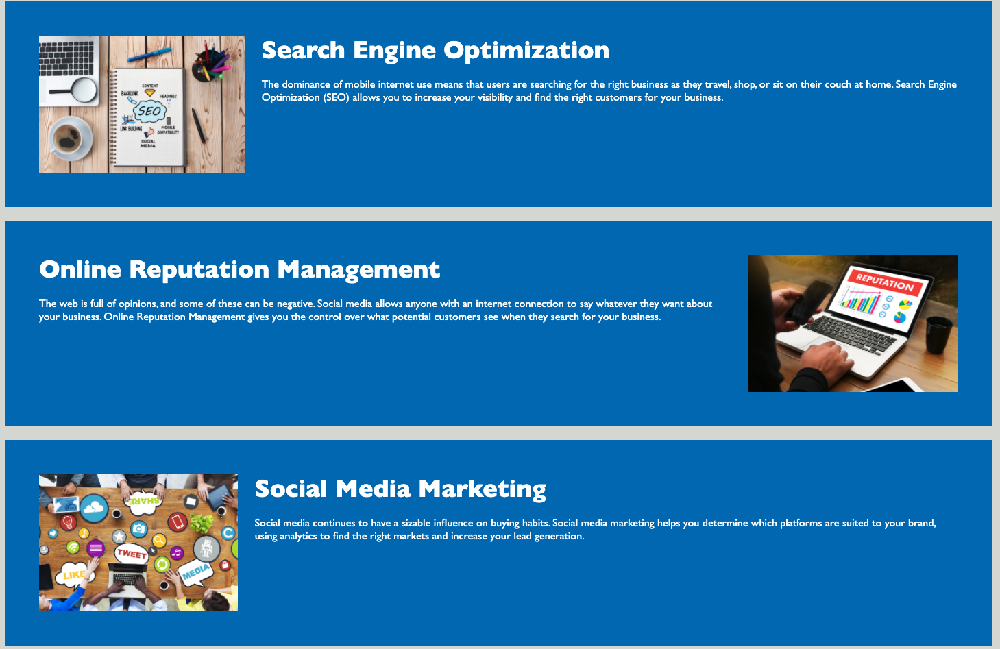

Project Name: Code Refactor
Project Description: This project refactors the code to align more with the HTML5 semantic standards.

Installation: NA

Usage: After accessing the website, you will get the landing page that will have three menu items: <Search Engine Optimizatio> <Online Reputation Management> and <Social Media Marketing>. Hitting on anyone of these links will take you to the associated section of the page that will give a short description of each.

Credits: Big shoutout to the TA's manning the breakout rooms.

License: NA

Test: Access site verify heder content - Heriseon Header Top left; the three menue items on top right <Search Engine Optimizatio> <Online Reputation Management> and <Social Media Marketing>. Verify the links navigate to the right area of the page.
